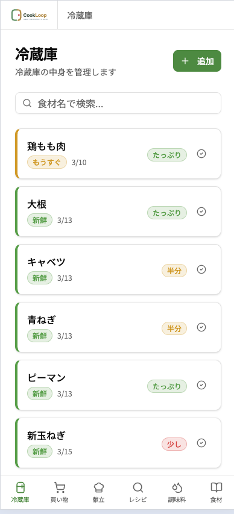
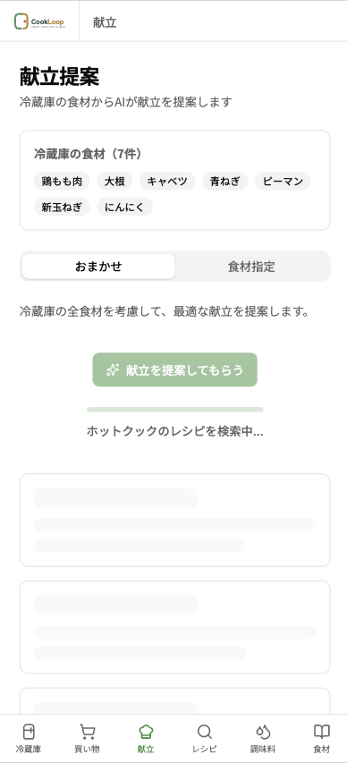
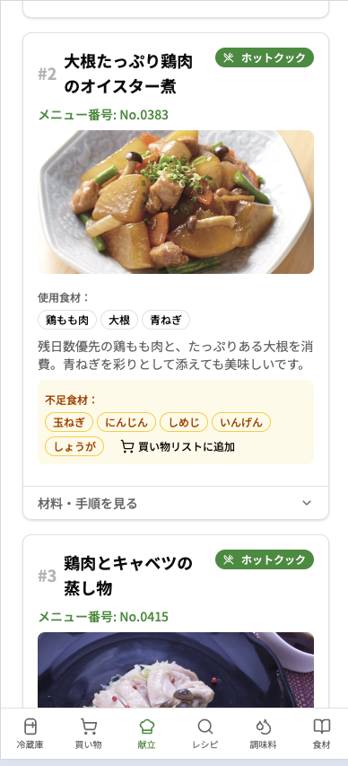
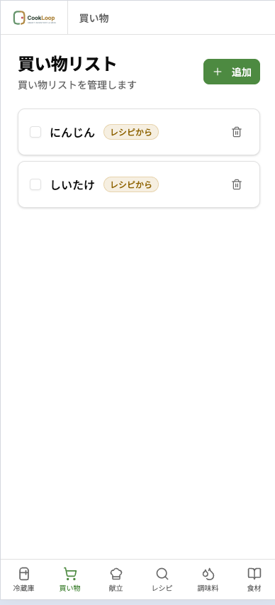

<p align="center">
  
</p>

我が家の主婦業を楽にするために作った個人用アプリ。

冷蔵庫の在庫と賞味期限を管理して、ホットクック公式レシピのデータをもとに Gemini が「今夜これ作れるよ」とメニュー番号付きで提案してくれる。無くなりそうな食材は自動で買い物リストに入る。このループが CookLoop。

## スクリーンショット

<p align="center">
  
  
  
  
</p>

## 主な機能

- **冷蔵庫管理** — 食材の在庫・残量・賞味期限を一覧管理。期限が近い食材は色で警告
- **献立提案（AI）** — 冷蔵庫の食材から Gemini が夕食を3品提案。ホットクックレシピはメニュー番号と手順付き
- **買い物リスト** — 定番食材が少なくなると自動追加。献立の不足食材もワンタップで追加
- **ホットクックレシピ検索** — 公式レシピ 654 件を料理名・食材名で横断検索
- **調味料管理** — 調味料の残量を別管理。少なくなったものを上部にソート
- **食材マスタ** — 食材の賞味期限目安を学習・蓄積。OpenSearch で表記揺れを吸収した検索

## セットアップ

```bash
mise install                # Python, Node.js, uv のインストール
cp .env.template .env       # 環境変数の設定
docker compose up -d        # 全サービス起動
mise run migrate            # マイグレーション実行
```

起動したら http://localhost:5173 (フロント) と http://localhost:8000/docs (API) が使える。

## 開発

```bash
mise run dev          # バックエンド開発サーバー
mise run dev:front    # フロントエンド開発サーバー
mise run lint:all     # 全体 lint
mise run test:all     # 全テスト
mise tasks            # コマンド一覧
```

## リポジトリの構成

```
backend/          FastAPI + SQLAlchemy + Alembic
frontend/         React 19 + TypeScript + Vite + Tailwind CSS + shadcn/ui
compose.yaml      Docker Compose (API, Frontend, MySQL, OpenSearch)
```

## ドキュメント

- [体験ビジョン・アプリの全体像](docs/00_core.md)
- [バックエンド仕様書（テーブル設計・API・Gemini 連携）](docs/01_backend.md)
- [デザイントークン](docs/02_design_tokens.md)
- [フロントエンド UX 仕様書](docs/03_frontend_ux.md)
